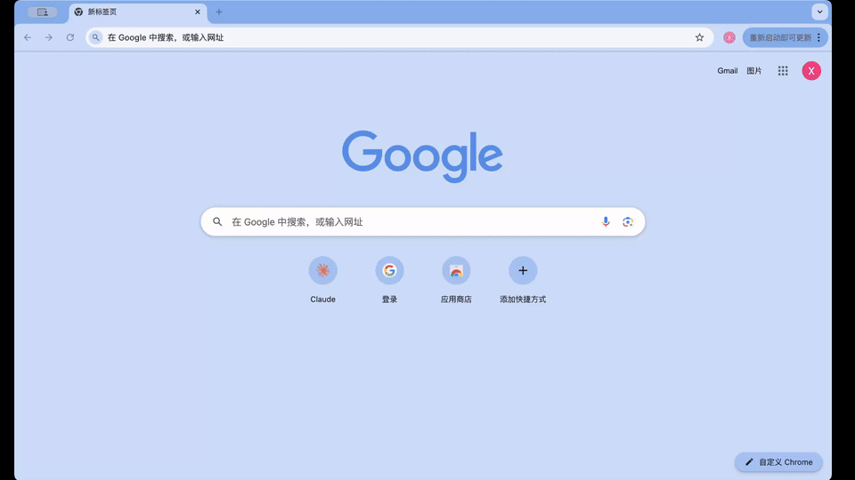

## Speech Repo

<br/>

[ English | [Chinese / 中文](README_zh.md) ]

Speech Repo is a Chrome extension focused on improving response efficiency and standardizing message templates. It is widely applicable to daily online communication scenarios for operations, customer support, and merchants.

## Demo
<p align="center">
  
</p>

## 🔧 Manual Installation
1. Download Speech Repo and extract the archive
2. Open Chrome and go to: chrome://extensions/
3. Enable Developer mode
4. Click Load unpacked and select the folder you just extracted, then click OK
5. ⚠️ Important: Do not disable Developer mode, otherwise the extension will not work
6. install demo:
<p align="center">
  
</p>


## 🎯 Project Background
In PC web-based instant messaging scenarios, standardized message templates can greatly improve reply efficiency and maintain content consistency. However, templates are often scattered across documents, spreadsheets, or chat records, and sometimes rely on personal memory. As business needs evolve, the variety of templates increases, making them hard to find, difficult to manage, and prone to version inconsistencies.

Speech Repo was developed to address these issues: it centralizes frequently used replies, organizes them with categories and tags, and provides one-click copy functionality—so templates are always ready when needed, without hunting through files or relying on memory.

## ✨ Features
  - Add, edit, and delete frequently used templates
  - One-click copy of any template, ready to paste on any PC web page
  - Customizable category structure with tags for precise search
  - Mini window mode
  - Multi-language support
  - Other features under development

## 🚀 Technical Highlights
 - Lightweight design: Only 2MB, minimal impact on browser performance
 - Offline support: Local storage mechanism, no network dependency
 - Data security: Local encrypted storage to protect sensitive information

## 🛠️ Development
- Frontend: React + TypeScript + Vite + Shadcn UI + Tailwind CSS
- Database：IndexedDB

1. Clone the repository:
   ```bash
   git clone <repository-url>
   cd speech-repo
   ```

2. Install dependencies:
   ```bash
   npm install
   ```

3. Build the project:
   ```bash
   npm run build
   ```

4. Load the extension:
   - Open Chrome and go to `chrome://extensions/`
   - Enable "Developer mode"
   - Click "Load unpacked" and select the `extensions` folder

## Sponsorship


### Commercial License
The open-source version is under the AGPL-3.0 License and can be used for personal learning and use. For commercial purposes, please contact the author for authorization.

## Contact
- Email:
yuanxiao5309@gmail.com

- WeChat

<br/>

