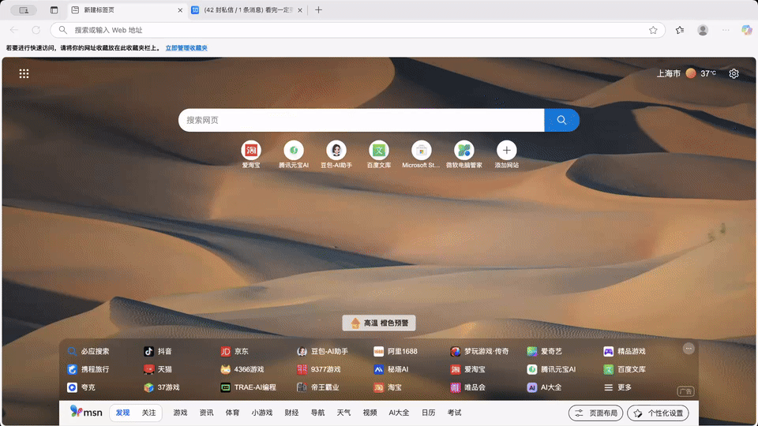

## Speech Repo

<br/>

[ English | [Chinese / 中文](README_zh.md) ]

Speech Repo is a browser extension designed to boost communication efficiency and streamline script management. It works seamlessly on both Chrome and Edge, making it a practical tool for operators, customer service teams, and merchants in their daily communication workflows.

## Demo
<p align="center">
  
</p>

## 🔧 Manual Installation
#### Chrome Extension
1. Download [Speech Repo](https://github.com/tabelf/speech-repo/releases/download/v0.1.0/extension.zip) and unzip the file
2. Open Chrome and go to: chrome://extensions/
3. Enable Developer Mode
4. Click Load unpacked extension and select the folder you just extracted, then click OK
5. ⚠️ Important: Do not disable Developer Mode, otherwise the extension will not work
6. install demo:
<p align="center"></p>

#### Edge Extension
1. Download [Speech Repo](https://github.com/tabelf/speech-repo/releases/download/v0.1.1/extension.zip) and unzip the file
2. Open Edge and go to: edge://extensions/
3. Enable Developer Mode.
4. Click Load unpacked extension..., select the unzipped folder, and confirm.
5. ⚠️ Important: Do not turn off Developer Mode, otherwise the extension will not run.
6. Installation demo:
<p align="center"></p>

## 🎯 Project Background
In PC web-based instant messaging scenarios, standardized message templates can greatly improve reply efficiency and maintain content consistency. However, templates are often scattered across documents, spreadsheets, or chat records, and sometimes rely on personal memory. As business needs evolve, the variety of templates increases, making them hard to find, difficult to manage, and prone to version inconsistencies.

Speech Repo was developed to address these issues: it centralizes frequently used replies, organizes them with categories and tags, and provides one-click copy functionality—so templates are always ready when needed, without hunting through files or relying on memory.

## ✨ Features
  - Add, edit, and delete frequently used templates
  - One-click copy of any template, ready to paste on any PC web page
  - Customizable category structure with tags for precise search
  - Mini window mode
  - Multi-language support
  - Other features under development

## 🚀 Technical Highlights
 - Lightweight design: Only 2MB, minimal impact on browser performance
 - Offline support: Local storage mechanism, no network dependency
 - Data security: Local encrypted storage to protect sensitive information

## 🛠️ Development
- Frontend: React + TypeScript + Vite + Shadcn UI + Tailwind CSS
- Database：IndexedDB

1. Clone the repository:
   ```bash
   git clone https://github.com/tabelf/speech-repo.git
   cd speech-repo
   ```

2. Install dependencies:
   ```bash
   npm install
   ```

3. Build the project:
   ```bash
   npm run build
   ```

4. Load the extension:
   - Open Chrome and go to `chrome://extensions/`
   - Enable "Developer mode"
   - Click "Load unpacked" and select the `extensions` folder

## Sponsorship


### Commercial License
The open-source version is under the AGPL-3.0 License and can be used for personal learning and use. For commercial purposes, please contact the author for authorization.

## Contact
- Email:
yuanxiao5309@gmail.com

- WeChat

<br/>

