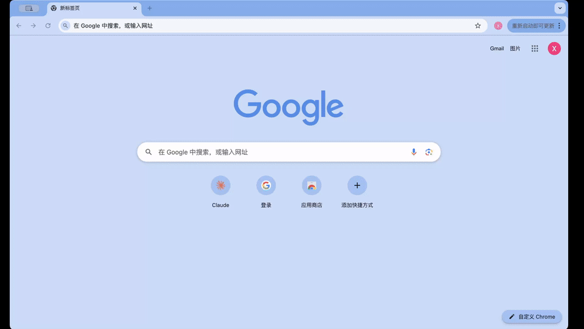

## Speech Repo

<br/>

[ [English/英文](README.md)  | Chinese ]

Speech Repo 话术库是一款专注于提升沟通效率和实现话术统一管理的 Chrome 插件，广泛适用于运营、客服及商户等日常沟通场景。


## 演示
<p align="center">
  
</p>

## 🔧 手动安装
1. 下载 [Speech Repo](https://github.com/justjavac/ReplaceGoogleCDN/archive/master.zip)
   然后解压
1. 打开 Chrome，输入: `chrome://extensions/`
1. 勾选 开发者模式 (Developer Mode)
1. 选择 加载未打包的扩展程序 (Load unpacked extension...) 然后选中刚才解压的文件夹目录，点击确定
1. 注意⚠️：不要勾掉 开发者模式 (Developer Mode)，否则无法运行
1. 安装演示:
<p align="center">
  
</p>


## 🎯 项目背景
在日常的网页在线聊天沟通场景中，标准化话术能显著提升回复效率和内容一致性。然而，话术往往零散地存放在文档、表格或聊天记录中，更多时候依赖个人记忆。随着业务不断迭代，话术种类越来越多，这种方式不仅查找困难，还容易导致管理混乱、版本不一致等问题。
话术库正是为了解决这一痛点而开发的：它将常用回复集中管理，通过分类和标签进行整理，并提供一键复制功能，让话术真正做到“需要时随取随用”。

## ✨ 核心功能
  - 支持新增、编辑、删除常用话术
  - 可一键复制指定话术内容，在PC端任意页面中直接粘贴使用
  - 支持自定义分类结构，结合标签实现更细粒度的检索
  - Mini 窗口模式
  - 多语言支持
  - 其他功能待完善

## 🚀 技术特性
- 轻量化设计：插件大小 2MB，不影响浏览器性能
- 离线可用：本地存储机制，无网络依赖
- 数据安全：本地加密存储，保护敏感信息

## 🛠️ 开发
- 前端：React + TypeScript + Vite + Shadcn UI + Tailwind CSS
- 数据库：IndexedDB

1. 克隆项目:
   ```bash
   git clone <repository-url>
   cd speech-repo
   ```

2. 安装依赖:
   ```bash
   npm install
   ```

3. 构建项目:
   ```bash
   npm run build
   ```

4. 加载扩展:
   - 打开 Chrome 并导航到 `chrome://extensions/`
   - 开启"开发者模式"
   - 点击"加载已解压的扩展程序"并选择 `extension` 文件夹

## 赞助


### 商用授权
开源版本采用AGPL3协议，可用于个人学习和使用，商业用途联系作者获得授权。

## 取得联系
- 邮箱
yuanxiao5309@gmail.com

- 微信

<br/>

